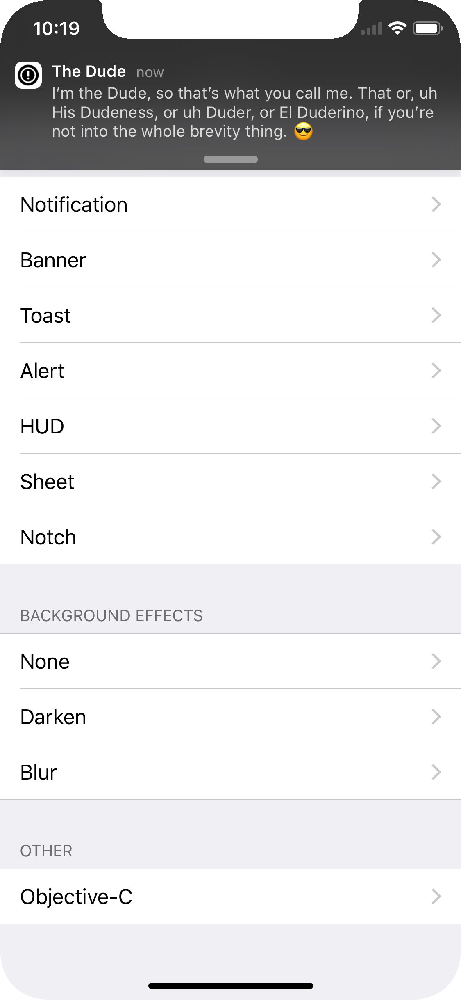
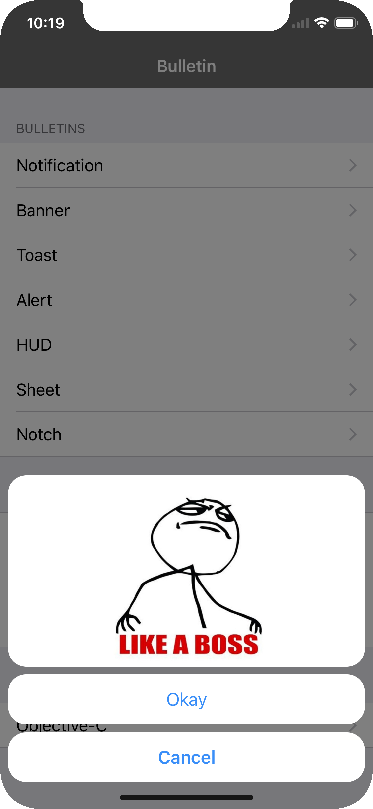

[](http://cocoapods.org/pods/Bulletin)


[](http://cocoapods.org/pods/Bulletin)

## Overview
Bulletin is a customizable alert library that makes it incredibly easy to build highly-stylized alerts for your app.

<table>
  <tr>
    <td style="border-color:transparent"></td>
    <td style="border-color:transparent"></td>
    <td style="border-color:transparent"></td>
    <td style="border-color:transparent"></td>
    <td style="border-color:transparent"></td>
    <td style="border-color:transparent"></td>
  </tr>
</table>
<table>
  <tr>
    <td style="border-color:transparent"></td>
    <td style="border-color:transparent"></td>
    <td style="border-color:transparent"></td>
    <td style="border-color:transparent"></td>
  </tr>
</table>

## Installation

- **Swift 4**: Version **<= 1.2.4**
- **Swift 5**: Version **>= 1.3.0**

### CocoaPods
Bulletin is integrated with CocoaPods!

1. Add the following to your `Podfile`:
```
use_frameworks!
pod 'Bulletin'
```
2. In your project directory, run `pod install`
3. Import the `Bulletin` module wherever you need it
4. Profit

### Manually
You can also manually add the source files to your project.

1. Clone this git repo
2. Add all the Swift files in the `Bulletin/` subdirectory to your project
3. Profit

## The Basics
The general flow of presenting a bulletin is as follows:

```Swift
let contentView = UIView()

let bulletin = BulletinView()
bulletin.embed(content: contentView)
bulletin.present()
```

You create a content view that later will be embedded into a containing `BulletinView`. We then create a `BulletinView` and configure it's style to our liking, embed our content, and present the bulletin.

The `BulletinView` will use your view's intrinsic content size to determine it's on-screen height. So make sure you have constraints setup properly! Alternatively, if you want to provide a static height for your content, use the following version of the `embed()` function:

```Swift
bulletin.embed(content: contentView, usingStrictHeight: 100)
```

## Default Styles

`BulletinView` has a ton of customization options; because of this, it includes pre-configured styles for the most common use cases. The current set of default styles include:

- notification
- banner
- status bar (toast)
- alert
- hud
- sheet

A bulletin can be created with one of these default styles like this:

```Swift
let bulletin = BulletinView.notification()
let bulletin = BulletinView.banner()
...
```

## Customization

Of course, you might want to go crazy and tweak everything to your liking. Here is an example of some of the things you can change:

```Swift
let bulletin = BulletinView()

// Basic options

bulletin.position = .top
bulletin.duration = .limit(5)
bulletin.soundEffectUrl = URL(...)

// Presentation

bulletin.presentationAnimation.duration = 0.4
bulletin.presentationAnimation.springDamping = 0.7
bulletin.presentationAnimation.springVelocity = 0.4

// Style

bulletin.style.statusBar = .lightContent
bulletin.style.backgroundEffect = .darken(alpha: 0.5)
bulletin.style.edgeInsets = UIEdgeInsets(horizontal: 8, vertical: 24)
bulletin.style.roundedCorners = .allCorners
bulletin.style.roundedCornerRadius = 4
bulletin.style.shadowColor = UIColor.black
bulletin.style.shadowOffset = CGSize(width: 0, height: 4)
bulletin.style.shadowRadius = 4
bulletin.style.shadowAlpha = 0.25
bulletin.style.isBackgroundDismissEnabled = true

// Taptics

bulletin.taptics.presentation = .notification(.success)
bulletin.taptics.action = .impact(.light)
bulletin.taptics.snapping = .impact(.medium)
```

..and many more. For more information regarding specific configuration option usage, refer to the code documentation.

## Actions

You might want to do something cool when someone taps on your bulletin. `BulletinView` has an optional `action` handler that does just that!

```Swift
let bulletin = BulletinView()
bulletin.action = {
    print("You tapped me!")
}
```

When an action handler is invoked, it's bulletin will automatically be dismissed.

## Appearance Delegate

`BulletinView` also has an optional `appearanceDelegate` that provides information about when & how a bulletin is presented/dismissed. The delegate includes the following functions:

```Swift
func bulletinViewWillAppear(_ bulletin: BulletinView)
func bulletinViewWillDisappear(_ bulletin: BulletinView)
func bulletinViewWasAutomaticallyDismissed(_ bulletin: BulletinView)
func bulletinViewWasInteractivelyDismissed(_ bulletin: BulletinView)
```

## SnapKit

[SnapKit](http://snapkit.io) is a wonderful library that helps ease the pain of working with programatic layout constraints. I use it daily, and you should too! Bulletin provides basic SnapKit integration via a specialized `snp_embed()` function that takes a SnapKit `ConstraintItem` instead of a strict height.

```Swift
bulletin.snp_embed(content: contentView, usingStrictHeightConstraint: anotherView.snp.height)
```

## Objective-C

Bulletin has _limited_ support for Objective-C. Creating & presenting a bulletin works the exact same way it does in Swift:

```Objective-C
@import Bulletin;

UIView *content = [[UIView alloc] init];
content.backgroundColor = [UIColor whiteColor];

BulletinView *bulletin = [[BulletinView alloc] init];
[bulletin setAppearanceDelegate:self];
[bulletin embedContent:content usingStrictHeight:120.0f];
[bulletin present];
```

Bulletin's **do not** support advanced styling options when used via Objective-C. However, the basic presentation options are available:

```Objective-C
BulletinView *bulletin = [[BulletinView alloc] init];
[bulletin setPosition:kBulletinViewPositionTop];
[bulletin setDuration:5];
[bulletin setLevel:kBulletinViewLevelDefault];
[bulletin setEdgeInsets:UIEdgeInsetsMake(8, 8, 8, 8)];
[bulletin setBackgroundEffect:kBulletinViewBackgroundEffectDarkenMedium];
[bulletin embedContent:contentView];
[bulletin present];
```

If you need more advanced styling options, you can create a simple Swift factory class _or_ an extension on `BulletinView` that returns fully-configured bulletins:

```Swift
class BulletinFactory {

    static func sexyBulletin() -> BulletinView {

        let bulletin = BulletinView()
        bulletin.position = .bottom
        bulletin.style.edgeInsets = UIEdgeInsets(horizontal: 0, vertical: 8)
        bulletin.style.backgroundEffect = .darken(alpha: 0.5)

        ...

        return bulletin

    }

}

extension BulletinView {

    static func sexy() -> BulletinView {

        let bulletin = BulletinView()
        bulletin.position = .bottom
        bulletin.style.edgeInsets = UIEdgeInsets(horizontal: 0, vertical: 8)
        bulletin.style.backgroundEffect = .darken(alpha: 0.5)

        ...

        return bulletin

    }

}
```

## Contributing

Pull-requests are more than welcome. Bug fix? Feature? Open a PR and we'll get it merged in!
